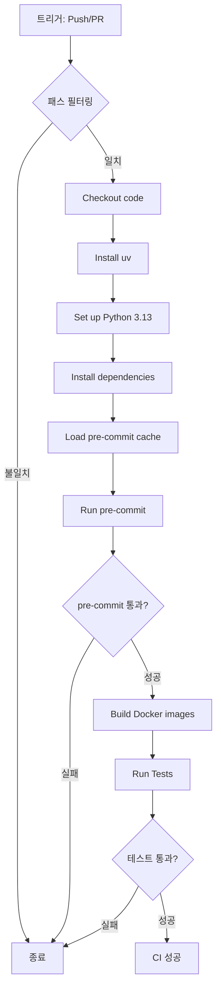

# CI/CD (Continuous Integration / Continuous Deployment)

이 문서는 GitHub Actions를 사용한 CI/CD 파이프라인에 대해 설명합니다.

## GitHub Actions 워크플로우

### 파일 위치
`.github/workflows/ci.yml`

### 워크플로우 이름
```yaml
name: Backend CI
```

## 트리거 조건

### Push 이벤트

```yaml
on:
  push:
    branches:
      - "main"
      - "master"
      - "develop"
      - "release/**"
      - "hotfix/**"
```

**대상 브랜치:**
- `main`, `master`: 메인 브랜치
- `develop`: 개발 브랜치
- `release/**`: 릴리즈 브랜치 (예: release/1.0.0)
- `hotfix/**`: 핫픽스 브랜치 (예: hotfix/critical-bug)

### Pull Request 이벤트

```yaml
pull_request:
  branches:
    - "main"
    - "master"
    - "develop"
```

PR 대상 브랜치가 main, master, develop일 때 실행

### 패스 필터링

```yaml
paths:
  - "app/**"
  - "tests/**"
  - ".pre-commit-config.yaml"
  - "pyproject.toml"
  - "uv.lock"
  - "Dockerfile"
  - "docker-compose.test.yml"
  - "docker-compose.yml"
```

**다음 파일 변경 시에만 실행:**
- 소스 코드 (`app/**`)
- 테스트 코드 (`tests/**`)
- 설정 파일 (pyproject.toml, pre-commit 등)
- Docker 관련 파일

**장점:**
- 불필요한 CI 실행 방지
- 리소스 절약
- 빌드 시간 단축

## Job 구성

### quality-and-test

단일 Job으로 품질 검사 및 테스트 수행

```yaml
jobs:
  quality-and-test:
    runs-on: ubuntu-latest
```

**실행 환경:**
- Ubuntu Latest (GitHub-hosted runner)

## 단계별 설명

### 1. Checkout code

```yaml
- name: Checkout code
  uses: actions/checkout@v4
```

**역할:**
- 저장소 코드를 runner로 체크아웃
- 이후 단계에서 코드 접근 가능

**버전:** v4 (최신)

### 2. Install uv

```yaml
- name: Install uv
  uses: astral-sh/setup-uv@v5
  with:
    version: "latest"
    enable-cache: true
```

**역할:**
- uv 패키지 관리자 설치
- 캐시 활성화로 속도 향상

**옵션:**
- `version: "latest"` - 최신 버전 사용
- `enable-cache: true` - uv 캐시 활성화

### 3. Set up Python

```yaml
- name: Set up Python
  run: uv python install 3.13
```

**역할:**
- Python 3.13 설치
- uv를 통한 자동 관리

### 4. Install dependencies

```yaml
- name: Install dependencies
  run: uv sync
```

**역할:**
- pyproject.toml의 모든 의존성 설치
- 개발 의존성 포함
- uv.lock 기반 재현 가능한 설치

### 5. Load cached pre-commit env

```yaml
- name: Load cached pre-commit env
  uses: actions/cache@v3
  with:
    path: ~/.cache/pre-commit
    key: pre-commit-${{ runner.os }}-${{ hashFiles('.pre-commit-config.yaml') }}
```

**역할:**
- Pre-commit 환경 캐싱
- 반복 실행 시 속도 대폭 향상

**캐시 키:**
- OS별 캐시 분리
- `.pre-commit-config.yaml` 해시값 기반
- 설정 변경 시 캐시 무효화

### 6. Run pre-commit

```yaml
- name: Run pre-commit
  run: uv run pre-commit run --all-files --show-diff-on-failure
```

**역할:**
- 모든 pre-commit 훅 실행
- 코드 품질 검사

**옵션:**
- `--all-files` - 모든 파일 검사 (변경 여부 무관)
- `--show-diff-on-failure` - 실패 시 diff 표시

**검사 항목** (15개 훅):
1. 파일 검사 (JSON, YAML, TOML 등)
2. YAML 포맷팅
3. 맞춤법 검사
4. Ruff (린팅 & 포맷팅)
5. Interrogate (문서화)
6. Mypy (타입 체크)
7. detect-secrets (비밀 정보)
8. uv lock 검사
9. pip-audit (취약점)
10. commitizen (커밋 메시지)

### 7. Build Docker images

```yaml
- name: Build Docker images
  run: docker compose -f docker-compose.test.yml build
```

**역할:**
- 테스트 환경의 모든 서비스 이미지 빌드
- Dockerfile의 test 스테이지 사용

**빌드되는 서비스:**
- test (테스트 실행 컨테이너)
- postgres (데이터베이스)
- redis (캐시)
- kafka (이벤트 스트리밍)

### 8. Run Tests via Docker Compose

```yaml
- name: Run Tests via Docker Compose
  run: docker compose -f docker-compose.test.yml run --rm test
```

**역할:**
- Docker Compose 환경에서 pytest 실행
- 격리된 환경에서 테스트

**테스트 환경:**
- PostgreSQL 17
- Redis 7
- Kafka 7.5.0 (KRaft 모드)
- 45개 환경 변수 설정

**실행 명령:**
- `--rm` - 테스트 완료 후 컨테이너 자동 삭제

## 워크플로우 실행 흐름



## 캐싱 전략

### 1. uv 캐시

```yaml
enable-cache: true
```

**캐시 대상:**
- uv 패키지 다운로드
- 빌드 아티팩트

**효과:**
- 의존성 설치 속도 향상
- 네트워크 사용량 감소

### 2. Pre-commit 캐시

```yaml
path: ~/.cache/pre-commit
key: pre-commit-${{ runner.os }}-${{ hashFiles('.pre-commit-config.yaml') }}
```

**캐시 대상:**
- Pre-commit 훅 환경
- 도구별 가상환경

**효과:**
- Pre-commit 실행 시간 대폭 단축
- 첫 실행: ~2-3분 → 이후: ~30초

### 3. Docker 레이어 캐시

GitHub Actions는 자동으로 Docker 레이어를 캐싱합니다.

**효과:**
- 변경되지 않은 레이어 재사용
- 빌드 시간 단축

## 실패 시 디버깅

### 1. Pre-commit 실패

```bash
# 로컬에서 동일하게 실행
uv run pre-commit run --all-files --show-diff-on-failure
```

**일반적인 원인:**
- Ruff 린팅 오류
- Mypy 타입 체크 오류
- 문서화 부족 (Interrogate)
- 비밀 정보 감지 (detect-secrets)

### 2. 테스트 실패

```bash
# 로컬에서 동일 환경 재현
docker compose -f docker-compose.test.yml run --rm test

# 또는 직접 pytest 실행
uv run pytest -vv
```

**일반적인 원인:**
- 테스트 로직 오류
- 환경 변수 누락
- 데이터베이스 연결 실패

### 3. Docker 빌드 실패

```bash
# 로컬에서 빌드 테스트
docker compose -f docker-compose.test.yml build

# 특정 서비스만
docker compose -f docker-compose.test.yml build test
```

**일반적인 원인:**
- Dockerfile 문법 오류
- 의존성 충돌
- 빌드 컨텍스트 문제

## 워크플로우 로그 확인

### GitHub UI에서 확인

1. Actions 탭 이동
2. 해당 워크플로우 실행 클릭
3. Job 및 Step 로그 확인

### 각 단계별 로그

```
► Checkout code
  ✓ 완료 (1s)

► Install uv
  ✓ 완료 (3s)

► Set up Python
  ✓ 완료 (15s)

► Install dependencies
  ✓ 완료 (45s)

► Load cached pre-commit env
  ✓ Cache restored (2s)

► Run pre-commit
  ✓ All checks passed (30s)

► Build Docker images
  ✓ 완료 (2m 30s)

► Run Tests via Docker Compose
  ✓ All tests passed (1m 15s)
```

## 성능 최적화

### 1. 패스 필터링 사용

불필요한 파일 변경 시 CI 건너뛰기

### 2. 캐싱 활용

- uv 캐시
- Pre-commit 캐시
- Docker 레이어 캐시

### 3. 병렬 실행

현재는 단일 Job이지만, 필요시 분리 가능:

```yaml
jobs:
  quality-check:
    # Pre-commit만 실행

  test:
    needs: quality-check
    # 테스트만 실행
```

### 4. Self-hosted Runner

대규모 프로젝트의 경우 Self-hosted runner 사용 고려

## 보안 Best Practices

### 1. 민감 정보 관리

```yaml
env:
  SECRET_KEY: ${{ secrets.SECRET_KEY }}
  DB_PASSWORD: ${{ secrets.DB_PASSWORD }}
```

GitHub Secrets 사용

### 2. 최소 권한

```yaml
permissions:
  contents: read
  pull-requests: write  # PR 코멘트용
```

### 3. 의존성 보안 검사

Pre-commit에 pip-audit 포함됨

```yaml
- id: pip-audit
  entry: uv run pip-audit
```

## CD (Continuous Deployment) 확장

현재는 CI만 구현되어 있으나, CD 추가 가능:

### 배포 Job 추가 예시

```yaml
deploy:
  needs: quality-and-test
  runs-on: ubuntu-latest
  if: github.ref == 'refs/heads/main'
  steps:
    - name: Deploy to production
      run: |
        # 배포 스크립트
```

### 릴리즈 자동화

```yaml
release:
  if: startsWith(github.ref, 'refs/tags/v')
  steps:
    - name: Create Release
      uses: actions/create-release@v1
```

## 모니터링

### 워크플로우 상태 배지

README.md에 추가:

```markdown

```

### 알림 설정

- GitHub 알림 설정
- Slack 통합
- 이메일 알림

## 비용 최적화

### GitHub Actions 무료 사용량

- Public 저장소: 무제한
- Private 저장소: 월 2,000분

### 사용량 확인

```bash
# Settings → Billing → Actions
```

### 최적화 팁

1. 필요한 경우에만 실행 (path filtering)
2. 캐싱 적극 활용
3. 병렬 실행으로 총 시간 단축
4. 불필요한 step 제거

## 트러블슈팅

### 캐시 문제

```yaml
# 캐시 강제 무효화 (key 변경)
key: pre-commit-${{ runner.os }}-v2-${{ hashFiles('.pre-commit-config.yaml') }}
```

### 타임아웃

```yaml
jobs:
  quality-and-test:
    timeout-minutes: 30  # 기본: 360분
```

### 디버그 로깅

```yaml
- name: Debug
  run: |
    echo "Python version: $(python --version)"
    echo "uv version: $(uv --version)"
    env | sort
```

## 추가 자료

- [GitHub Actions 문서](https://docs.github.com/en/actions)
- [Docker Compose 문서](https://docs.docker.com/compose/)
- [uv CI 가이드](https://docs.astral.sh/uv/guides/integration/github/)
