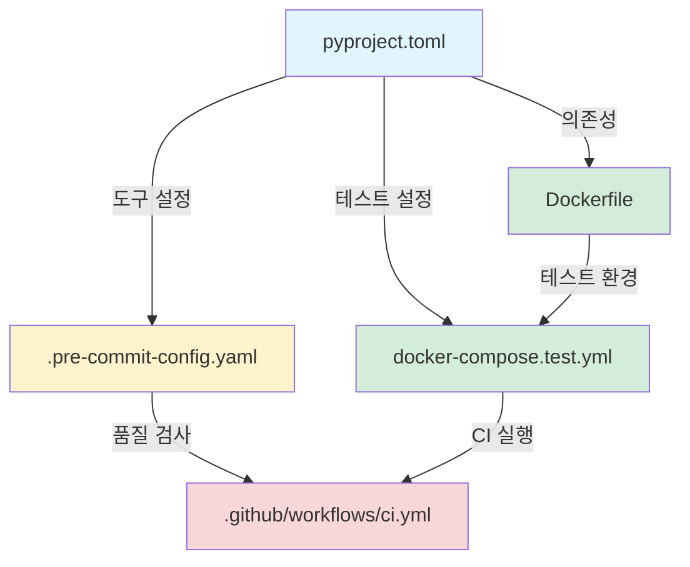

# 프로젝트 설정 요약 (Configuration Summary)

이 문서는 프로젝트의 전체 설정을 한눈에 파악할 수 있도록 요약합니다.

## 설정 파일 개요

| 파일 | 목적 | 주요 내용 |
|------|------|-----------|
| `pyproject.toml` | 프로젝트 메타데이터 및 도구 설정 | 의존성, Ruff, Mypy, Pytest, Coverage, Commitizen |
| `.pre-commit-config.yaml` | Git pre-commit 훅 설정 | 15개 자동 검사 도구 |
| `Dockerfile` | 컨테이너 이미지 정의 | 6개 멀티 스테이지 빌드 |
| `docker-compose.test.yml` | 테스트 환경 구성 | PostgreSQL, Redis, Kafka |
| `.github/workflows/ci.yml` | CI/CD 파이프라인 | GitHub Actions 워크플로우 |
| `.gitmessage` | 커밋 메시지 템플릿 | Conventional Commits 형식 |

## 설정 파일 간 관계



## 도구별 설정 요약

### Ruff (린팅 & 포맷팅)

**설정 위치:** `pyproject.toml > [tool.ruff]`

| 항목 | 값 |
|------|-----|
| 라인 길이 | 120 |
| Python 버전 | 3.13 |
| 린트 규칙 | 25개 카테고리 |
| 문서 스타일 | Google |
| 복잡도 제한 | 10 |

**실행 명령어:**
```bash
uv run ruff check .
uv run ruff format .
```

### Mypy (타입 체크)

**설정 위치:** `pyproject.toml > [tool.mypy]`

| 항목 | 값 |
|------|-----|
| Mode | Strict |
| Python 버전 | 3.13 |
| 플러그인 | pydantic.mypy |
| Import 오류 무시 | True |

**실행 명령어:**
```bash
uv run mypy .
```

### Pytest (테스트)

**설정 위치:** `pyproject.toml > [tool.pytest.ini_options]`

| 항목 | 값 |
|------|-----|
| 병렬 실행 | auto (CPU 코어 수) |
| 커버리지 대상 | app/ |
| 최소 커버리지 | 80% |
| HTML 보고서 | report.html |

**실행 명령어:**
```bash
uv run pytest
uv run pytest --cov
```

### Commitizen (커밋 관리)

**설정 위치:** `pyproject.toml > [tool.commitizen]`

| 항목 | 값 |
|------|-----|
| 스타일 | Conventional Commits |
| 버전 관리 | Semantic Versioning |
| 태그 형식 | v$version |
| Changelog | 자동 생성 |

**실행 명령어:**
```bash
uv run cz commit
uv run cz bump
```

## Pre-commit Hooks (14개)

| 번호 | Hook | 목적 | 실행 시점 |
|------|------|------|-----------|
| 1-14 | 파일 검사 | JSON, YAML, TOML 검증 | pre-commit |
| 15 | yamlfmt | YAML 포맷팅 | pre-commit |
| 16 | codespell | 맞춤법 검사 | pre-commit |
| 17-18 | ruff | 린팅 & 포맷팅 | pre-commit |

| 20 | mypy | 타입 체크 | pre-commit |
| 21 | detect-secrets | 비밀 정보 검사 | pre-commit |
| 22 | uv-lock-check | 의존성 동기화 | pre-commit |
| 23 | pip-audit | 취약점 검사 | pre-commit |
| 24 | commitizen | 커밋 메시지 검증 | commit-msg |

## Docker 스테이지

| 스테이지 | 기반 | 용도 | 크기 |
|----------|------|------|------|
| base | python:3.13-slim | 공통 기반 | ~400MB |
| prod-deps | base | 프로덕션 의존성 | ~500MB |
| dev-deps | prod-deps | 개발 의존성 | ~700MB |
| test | dev-deps | CI/CD 테스트 | ~800MB |
| release | python:3.13-slim | 프로덕션 배포 | ~400MB |
| dev | dev-deps | 로컬 개발 | ~900MB |

## 테스트 환경 (Docker Compose)

| 서비스 | 이미지 | 포트 | Health Check |
|--------|--------|------|--------------|
| test | Dockerfile:test | - | - |
| postgres | postgres:17 | 5432 | ✓ |
| redis | redis:7-alpine | 6379 | - |
| kafka | cp-kafka:7.5.0 | 9092 | - |

## CI/CD 파이프라인

### 단계

| 순서 | 단계 | 시간 (예상) |
|------|------|-------------|
| 1 | Checkout code | ~2s |
| 2 | Install uv | ~3s |
| 3 | Set up Python | ~15s |
| 4 | Install dependencies | ~45s |
| 5 | Load pre-commit cache | ~2s |
| 6 | Run pre-commit | ~30s |
| 7 | Build Docker images | ~2m 30s |
| 8 | Run tests | ~1m 15s |
| **총** | | **~5m** |

### 캐싱
- uv 패키지 캐시
- Pre-commit 환경 캐시
- Docker 레이어 캐시

## 품질 기준 (Quality Gates)

| 항목 | 도구 | 기준 | 실패 시 |
|------|------|------|---------|
| **타입 체크** | Mypy | Strict 통과 | Pre-commit 차단 |
| **테스트 커버리지** | Coverage | ≥ 80% | Pytest 실패 |
| **복잡도** | Ruff (McCabe) | ≤ 10 | Ruff 에러 |
| **보안** | detect-secrets | 0 비밀 정보 | Pre-commit 차단 |
| **취약점** | pip-audit | 0 취약점 | Pre-commit 경고 |
| **커밋 형식** | commitizen | Conventional | commit-msg 차단 |

## 의존성 관리

### 프로덕션 의존성
```toml
dependencies = [
    "pydantic>=2.12.5"
]
```

### 개발 의존성 (14개)
```toml
[dependency-groups]
dev = [
    "commitizen>=4.11.0",
    "detect-secrets>=1.5.0",
    "httpx>=0.28.1",
    "mypy>=1.19.1",
    "pip-audit>=2.10.0",
    "pre-commit>=4.5.1",
    "pytest>=9.0.2",
    "pytest-asyncio>=1.3.0",
    "pytest-cov>=7.0.0",
    "pytest-html>=4.1.1",
    "pytest-mock>=3.15.1",
    "pytest-xdist>=3.8.0",
    "ruff>=0.14.10",
]
```

## 환경 변수

### 필수 환경 변수

| 변수 | 설명 | 예시 |
|------|------|------|
| `DEBUG` | 디버그 모드 | True/False |
| `SECRET_KEY` | 암호화 키 | random-secret |
| `DB_HOST` | 데이터베이스 호스트 | localhost |
| `DB_PORT` | 데이터베이스 포트 | 5432 |
| `DB_NAME` | 데이터베이스 이름 | app_db |
| `REDIS_URL` | Redis URL | redis://localhost:6379 |

### 테스트 전용 변수 (45개)

docker-compose.test.yml에 정의됨

## 파일 크기 최적화

### Dockerignore
```
.git
__pycache__
*.pyc
.env
.venv
tests/load/
docs/
```

### Gitignore
```
.env
*.pyc
__pycache__/
.venv/
htmlcov/
.coverage
report.html
```

## 보안 설정

### 1. 비-루트 사용자 (Docker)
```dockerfile
USER appuser
```

### 2. 의존성 잠금
```bash
uv.lock  # 재현 가능한 빌드
```

### 3. 비밀 정보 검사
```yaml
detect-secrets: 모든 커밋마다 실행
```

### 4. 취약점 스캔
```yaml
pip-audit: 의존성 보안 검사
```

## 버전 관리

### Semantic Versioning

```
MAJOR.MINOR.PATCH
```

- MAJOR: Breaking changes
- MINOR: New features
- PATCH: Bug fixes

### 자동 버전 범프

```bash
uv run cz bump
```

## 성능 최적화

### 1. uv 캐싱
- 패키지 다운로드 캐시
- 빌드 아티팩트 캐시

### 2. Docker 레이어 캐싱
- 의존성 먼저 복사
- 소스 코드 나중에 복사

### 3. 병렬 테스트
```bash
pytest -n auto  # CPU 코어 수만큼
```

### 4. CI 캐싱
- uv 캐시
- Pre-commit 캐시
- Docker 레이어 캐시

## 로깅 설정

### 애플리케이션 로그
```
logs/
  ├── app.log
  └── error.log
```

### Docker 로그
```yaml
logging:
  driver: "json-file"
  options:
    max-size: "5m"
    max-file: "2"
```

## 모니터링 포인트

1. **CI/CD 성공률**
2. **테스트 커버리지**
3. **빌드 시간**
4. **Docker 이미지 크기**
5. **의존성 취약점 수**

## 트러블슈팅 체크리스트

### 빌드 실패
- [ ] pyproject.toml 문법 확인
- [ ] uv.lock 동기화 확인
- [ ] Dockerfile 문법 확인

### 테스트 실패
- [ ] 환경 변수 설정 확인
- [ ] 데이터베이스 연결 확인
- [ ] 테스트 격리 확인

### Pre-commit 오류
- [ ] 로컬에서 동일 명령 실행
- [ ] 캐시 정리 후 재시도
- [ ] 특정 훅 버전 확인

## 추가 문서

더 자세한 내용은 다음 문서를 참조하세요:

- **[개발 환경](development.md)** - 개발 도구 및 설정 상세
- **[테스트 가이드](testing.md)** - 테스트 전략 및 실행
- **[Docker](docker.md)** - 컨테이너 설정 상세
- **[CI/CD](ci-cd.md)** - GitHub Actions 워크플로우

## 빠른 참조

### 일상적인 명령어

```bash
# 개발 시작
uv sync
uv run pre-commit install

# 코드 작성 후
uv run ruff check --fix .
uv run pytest --cov

# 커밋
uv run cz commit

# Docker 테스트
docker compose -f docker-compose.test.yml up --build
```

### 문제 해결

```bash
# 의존성 문제
uv sync --reinstall
uv cache clean

# Pre-commit 문제
uv run pre-commit clean
uv run pre-commit install --install-hooks

# Docker 문제
docker compose -f docker-compose.test.yml down -v
docker system prune -a
```
